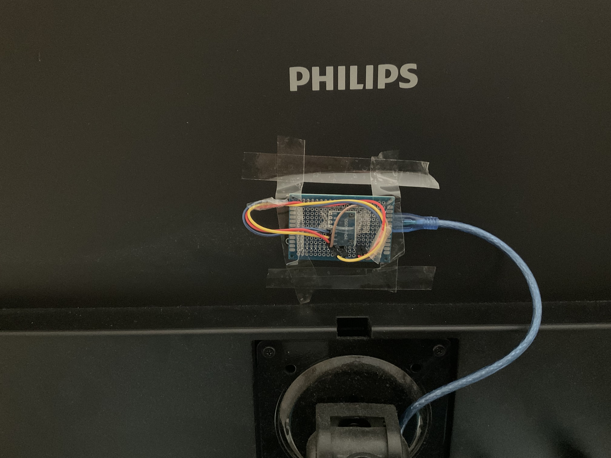

---
author:
- Lorenzo Maria Vaccarini
title: External Monitor Pose Detection
---

# Project Description

The project goal is to detect the external monitor pose in order to
automatically manage its screen orientation. To achieve this it will be
necessary to:

1.  **Estimate the monitor's pose:** A gyroscope sensor will be used to
    gather data about the monitor's pose.

2.  **Analyze data:** The data stream will be periodically analyzed by a
    microcontroller in order to check any sensible pose change
    (+/-90° roll).

3.  **Transmit data:** Once detected a sensible pose change, an event
    notification must be sent to a MQTT broker (publish event)

4.  **Data reception:** Once the event notification is received by the
    machine responsible for the monitor screen orientation, it will be
    processed accordingly to the running OS (in this case Ubuntu
    18.04.6) and finally set the monitor either in portrait or
    horizontal mode.

# Hardware

In order to sense the monitor pose a **MPU6050** will be used, which
will then send the sensed data to an **ESP8266** microcontroller.

Both the microcontroller and the sensor are soldered on a simple pcb and
the following pins are connected:

-   MPU6050 3V <-> ESP8266 3V

-   MPU6050 GND <-> ESP8266 GND

-   MPU6050 SCL <-> ESP8266 Digital Pin 5

-   MPU6050 SDA <-> ESP8266 Ditigial Pin 7

The whole thing is then attached to the back of an external monitor,
providing a 5V power supply through a USB-A cable.

As the pictures suggest, this is a prototype, kept together with jumper
cables and scotch tape, instead of soldered wires and a better adhesive
case.

# Software

## Microcontroller

The ESP8266 code is divided in a main **.ino** file
(IoT_Final_Project.ino) and two headers (MPUHeader.h and MQTTHeader.h).\
\
The **MPUHeader** file is responsible for the initialization of the
MPU6050 sensor and provides a set of API to read the MPU6050's
registers.\
\
The **MQTTHeader** file manages the mqtt connection and publishing
process. It includes the ESP8266Wifi.h library and the PubSubClient.h
library in order to easily access the MPU6050 antenna without having to
interact directly with it.\
\
The main **.ino** file contains only two functions as specified in the
**Wiring** framework:

-   **Setup**:

    1.  Initiate the **Serial** interface and the **Wire** interface

    2.  Calls the **initMPU** method: Overwrites the MPU6050's registers
        in order to optimize the sensing process (enabling sleep cycles,
        cycle duration, sampling frequencies ecc\...)

    3.  Calls the **setNominalRoll** function, sampling the initial
        monitor pose

    4.  Disables the antenna

-   **Loop**:

    1.  Calls the **readStatus** method, reading the MPU6050's status
        register, checking if new data is available

    2.  If new data is available and the pose is different from the
        nominal one, the antenna is turned on, the ESP8266 connects to
        the wifi and to the mqtt broker. At this point the right command
        is forged and is published on the specified topic.\
        Finally the antenna gets turned off again.

## Node-Red

The node-red script is fairly short and simple for an Linux machine
thanks to the built-in command **xrandr**.

Once connected to the broker and subscribed to the specified topic,
every received message will be appended to the xrandr command.\
**Example:**

1.  The ESP8266 notices a change in the pose, the monitor is now in a
    vertical position: it publishes **--output ScreenID --rotate
    left\"**

2.  The node-red process subscribed to the topic receives the message
    and appends it to the **xrandr** command and a shell executes:
    **xrandr --output ScreenID --rotate left**

## Custom parameters

The following parameters are user-specific:

1.  **screenID**: The screenID variable found in the **.ino** file needs
    to be filled with your personal screen identifier. It's possibile to
    find it through **xrandr -q**.

2.  **ssid**: The 2.4Ghz network name. The variable is placed in the
    **MQTTHeader.h** file.

3.  **password**: The WPA2-PSK associated to the already specified
    network. The variable is placed in the **MQTTHeader.h** file.

4.  **\[OPTIONAL\] broker**: The default broker is
    **test.mosquitto.org**. The variable is placed in the
    **MQTTHeader.h** file.

5.  **\[OPTIONAL\] topic**: The default topic is **ESP8266/test**. The
    variable is placed in the **MQTTHeader.h** file.

6.  **\[OPTIONAL\] port**: The default port is 1883. The variable is
    placed in the **MQTTHeader.h** file.

# Power Optimization

As already mentioned, the current project is a early-stage prototype and
as such is powered though a USB-A 5V power supply. Nevertheless some
power optimization has been introduced, making battery supply viable (or
at least partially).

-   **ESP8266's antenna disabled most of the time**: Since the **RX/TX**
    circuit is the most expensive one, the antenna is turned off since
    the very beginning and is turned on only after a new pose detection.
    This leads to a trade-off between response-time and power
    consumption but the mean connection time is around 1.5 second, which
    is a reasonable time considering potential small pose adjustment
    after the main first one.

-   **MPU6050 optimization**: The **initMPU** method manages the MPU's
    registers which allow for some customization such as **sampling**
    and **output rate**, **sleep cycles**, **temperature and
    accelerometer sensor disabling**.
